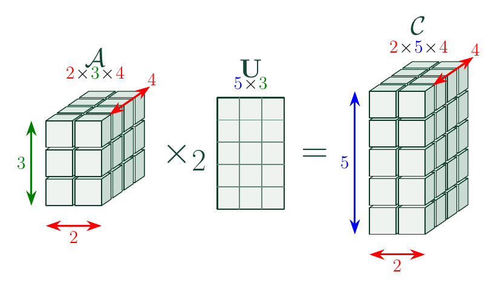

## Motivation

- Many datasets are naturally high-dimensional with structured covariance
  + RGB video - order 4 (x, y, color channel, time)
  + Medical imaging - order 4 (x, y, z, time)
  + Sensors over space and time   
  
::: {.fragment}
- Established software implementations and methods exist for vector- and matrix-variate data
- Analysts often matricize tensor data to use these methods

:::

::: {.hidden}
$$
\newcommand{\ve}[1]{\mathbf{#1}}
\newcommand{\field}[1]{\mathbb{#1}}
\newcommand{\defn}[1]{\emph{#1}}
\newcommand{\oneVect}[1]{#1}
\newcommand{\mat}[1]{\mathbf{#1}}
\newcommand{\matrix}[1]{\mathbf{#1}}
\newcommand{\oneMat}[1]{#1}
\newcommand{\tensor}[1]{\mathcal{#1}}
\newcommand{\oneTensor}[1]{#1}
\newcommand{\vs}[1]{\mathcal{#1}}
$$
:::


```{r setup, include = FALSE}
knitr::opts_chunk$set(dev = "png", dpi = 300)
library(tidyverse)
library(patchwork)
library(tensortools)
theme_set(theme_minimal(16))
theme_update(plot.title = element_text(hjust = 0.5))

plot_matrix <- function(input) { # function to plot matrices
  input |>
    as_tibble(.name_repair = ~ paste0("V", seq_along(.))) |>
    mutate(row = row_number()) |>
    pivot_longer(-row, names_to = "col", values_to = "value") |>
    mutate(col = as.integer(str_remove(col, "^V"))) |>
    ggplot(aes(x = col, y = row, fill = value)) +
    geom_tile(color = "black", lwd = 0.1) +
    scale_y_reverse() +
    theme_minimal()
}
```


## Tensors
- Tensors - generalization of vectors and matrices [@tensorDecomp]
- Order - number of indices needed to specify a value
    + Vector has order 1, matrix has order 2
- Mode - specific axis of tensor (rows = 1st mode, cols = 2nd mode)

<!-- {fig-align="center"} -->


## $\times_{n}$ Product
- Let $\tensor{A} \in \field{k}^{\color{red}{I_1} \times \color{red}{I_2} \times \dots \times \color{green}{I_n} \times \dots \times \color{red}{I_{O}}}$ and a matrix $\matrix{U} \in \field{k}^{\color{blue}{J} \times \color{green}{I_n}}$
- Then $\tensor{C} = \tensor{A} \times_{n} \mat{U}$ has entries

$$c_{\color{red}{i_1, \dots, i_{n-1},} \color{blue}{j} \color{red}{, i_{n+1}, \dots, i_O}} = \sum_{\color{green}{k=1}}^{\color{green}{I_n}} a_{\color{red}{i_1, \dots, i_{n-1}, \color{green}{k}, i_{n+1}, \dots, i_O}} u_{\color{blue}{j, \color{green}{k}}}$$

- The result has dimensions $I_1 \times \cdots \times I_{n-1} \times J \times I_{n+1} \times \cdots \times I_O$ and remains order $O$
- Acts along mode $n$ while leaving the other modes intact

## $\times_{n}$ Product

{fig-alt="n-mode product" width="100%" fig-align="center"}

- Analogous to matrix multiplication
- The matrix acts along one mode of the tensor, forming weighted combinations along that mode 


## Tensor Variate Normal (TVN)

<table class="tvn-structure-table" style="font-size: 0.85em;">
<colgroup>
<col style="width: 11%;">
<col style="width: 24%;">
<col style="width: 33%;">
<col style="width: 32%;">
</colgroup>
<thead>
<tr>
<th>Object</th>
<th>Standard-normal</th>
<th>Transformation</th>
<th>Covariance structure</th>
</tr>
</thead>

<tbody>
<tr>
<td>Scalar</td>
<td>$Z \in \mathbb{R}^{1}$</td>
<td>$X=\mu+\sigma Z$</td>
<td>$\sigma^2$</td>
</tr>

<tr class="fragment">
<td>Vector</td>
<td>$\ve{Z}\in\mathbb{R}^{p}$</td>
<td>$\ve{X}=\boldsymbol{\mu}+\mat{A}\ve{Z}$</td>
<td>$\mat{A}\mat{A}^{T}=\Sigma$</td>
</tr>

<tr class="fragment">
<td>Matrix</td>
<td>$\mat{Z}\in\mathbb{R}^{p\times q}$</td>
<td>$\mat{X}=\mat{M} + \mat{A} \mat{Z} \mat{B}^{T}$</td>
<td>$U=\mat{A}\mat{A}^{T},\;V=\mat{B} \mat{B}^{T}$</td>
</tr>

<tr class="fragment">
<td>Tensor</td>
<td>$\tensor{Z}\in\mathbb{R}^{I_1 \times \cdots \times I_D}$</td>
<td>$\tensor{X}=\tensor{M} + \mathcal{Z} \times_{d=1}^{D} \mat{A}_{d}$
</td>
<td>$\Sigma_{d}=\mat{A}_{d}\mat{A}_{d}^{T}$</td>
</tr>
</tbody>
</table>

::: {.fragment}
- Note that the matrix transform can be written as 

$$\mat{X} = \mat{M} + \mat{Z} \times_{1} \mat{A} \times_{2} \mat{B}$$
:::

::: {.fragment}
- Start with IID standard normal draws in the structure, apply a linear transformation, add a mean [@tensornormprop]
:::

## Tensor Variate Normal (TVN)

- Model assumption: separable covariance structure
  + Each mode $d$ has a covariance factor $\Sigma_d$
  + Together, the mode-specific factors define the full covariance: 
  
  $$\text{vec}(\mathcal{X}) \sim N(\text{vec}(\tensor{M}), \Sigma_D\otimes\cdots\otimes\Sigma_1)$$
  
::: {.fragment}
- Scaling identifiability issue: covariance structure is the same for different scalings of the covariance matrices
  + $\Sigma_{2} \otimes\Sigma_1 = a \Sigma_2 \otimes \frac{1}{a} \Sigma_{1}$
  + Only the full Kronecker product is uniquely determined [@manceur2013tensorMLE]
:::


## TVN in tensortools

- `tensortools` supports r and d functions similar to base R
- `rtnorm()` requires arguments n, mu, sigmas
    + mu is the mean tensor. Its dimension is the same as the draws $\tensor{X}$ 
    + sigmas expects a list of covariance matrices. For mode $d$, $\Sigma_d \in \mathbb{R}^{I_d \times I_d}$

```{r param, echo = FALSE}
mu_true <- tensor(data = 1:24, dim = c(2, 3, 4))

S1 <- matrix(c(
  1.0, 0.5,
  0.5, 1.0
), nrow = 2, byrow = TRUE)

S2 <- matrix(c(
  1.0, 0.4, 0.2,
  0.4, 1.0, 0.3,
  0.2, 0.3, 1.0
), nrow = 3, byrow = TRUE)

S3 <- matrix(c(
  1.0, 0.3, 0.2, 0.1,
  0.3, 1.0, 0.4, 0.2,
  0.2, 0.4, 1.0, 0.3,
  0.1, 0.2, 0.3, 1.0
), nrow = 4, byrow = TRUE)

sigmas_true <- list(S1, S2, S3)
```


```{r generate-normals, echo = TRUE}
(draws <- rtnorm(n = 100, mu = mu_true, sigmas = list(S1, S2, S3)))
```

## TVN in tensortools

- Density evaluation is also supported with `dtnorm()`
  + Requires arguments x, mu, sigmas 

```{r density-normal, echo = TRUE}
dtnorm(draws[1], mu_true, sigmas = list(S1, S2, S3), log = TRUE)
```


## TVN in tensortools

- MLE estimation is supported with `tensor_mle()`
  + Requires arguments draws and model 
  + Output is a list of the MLEs along with the log-likelihood, k, AIC, BIC

```{r mles, echo = TRUE}
tvn_mles <- tensor_mle(draws, model = "normal")

tvn_mles$sigmas[[1]]
S1
```


## Tensor class

- Tensor class is internally an array
  + Stores $n$ IID observations, operations apply to each one

```{r tensor-class, echo = TRUE}
print(draws[1:2], entries = 3)
```


## Tensor class
```{r tensor-class-subtract, echo = TRUE}
centered_draws <- draws - mu_true

print(centered_draws[1:2], entries = 3)

print(n_prod(centered_draws[1:2], 1, S1), entries = 3)
```

## Application: GRABMyo

- GRABMyo (Gesture Recognition and Biometrics Electromyogram) data from **43 participants** treated as IID observations [@grabmyo; @pradhan2022grabmyo]
- Each participant performed **16 hand gestures** in 7 repeated trials
- There were **28 active EMG channels**
- Collapse each 5-second recording at 2,048 Hz into **16 time bins**
- Average the seven trials for each participant and gesture after time binning

::: {.fragment}
- Each observation is a $16\;\text{gestures}\times 28\;\text{channels}\times 16\;\text{time bins}$ tensor
:::

## GRABMyo: electrode layout and gesture set

::: {.columns}


::: {.column width="42%"}

{fig-alt="List of hand gestures in the GRABMyo dataset" width="100%"}
:::

::: {.column width="58%"}
{fig-alt="Electrode locations" width="100%"}
:::

:::

## GRABMyo Values

```{r grabmyo-explore, echo = FALSE}
grabmyo_data <- readRDS("grabmyo_session1_tensors_16x28x16.rds")
grabmyo_array <- simplify2array(grabmyo_data)
grabmyo_tensor <- as_tensor(grabmyo_array, obs = 4)

plot_matrix(grabmyo_tensor[1][1, , ]) +
  labs(x = "Time Bin", y = "EMG Channel", title = "Participant 1, Gesture 1", fill = "Log RMS-Amplitude")
```


<!-- ## From raw recordings to tensor-valued observations -->

<!-- The processing preserves the scientific modes while producing a compact sample: -->

<!-- 1. Convert the public WFDB recordings from device counts to millivolts. -->
<!-- 2. Remove the four unused channels, leaving 28 active EMG channels. -->
<!-- 3. Divide each five-second recording into 16 equal movement-phase bins. -->
<!-- 4. Compute log-RMS amplitude within each bin. -->
<!-- 5. Average the seven trials for each participant and gesture. -->

<!-- ::: {.fragment} -->
<!-- The result is a list of 43 tensors, each with dimensions -->

<!-- $$16\times28\times16.$$ -->
<!-- ::: -->

<!-- ::: {.fragment} -->
<!-- The preprocessing is not the contribution here; it creates a natural tensor-valued sample for evaluating the modeling workflow. -->
<!-- ::: -->

## GRABMyo Model Output
```{r grabmyo-fit-models, cache=TRUE}
grabmyo_fit_timed <- function(label, draws, model = "normal") {
  message(
    "Fitting ", label, " with dimensions ",
    paste(dim(draws[[1]]), collapse = " x ")
  )
  started <- Sys.time()
  fit <- tensor_mle(
    draws,
    model = model,
    max_iter = 1000,
    tol = 1e-6,
    quiet = FALSE
  )
  fit$elapsed_seconds <- as.numeric(difftime(
    Sys.time(), started, units = "secs"
  ))
  fit
}

#fit the tensor
grabmyo_fits <- list(tensor = grabmyo_fit_timed("tensor", grabmyo_tensor))

for (mode in 1:3) { #fit the matricizations
  matrix_draws <- matricization(grabmyo_tensor, k = mode) 
  label <- paste0("mat", mode)
  grabmyo_fits[[label]] <- grabmyo_fit_timed(label, matrix_draws)
  rm(matrix_draws)
}
```


```{r grabmyo-model-output}
grabmyo_dimensions <- c(
  tensor = "16 x 28 x 16",
  mat1 = "16 x 448",
  mat2 = "28 x 256",
  mat3 = "16 x 448"
)

grabmyo_results <- purrr::imap_dfr(
  grabmyo_fits,
  \(fit, model) tibble::tibble(
    model,
    dimensions = grabmyo_dimensions[[model]],
    loglik = fit$loglik,
    k = fit$k,
    BIC = fit$BIC,
    AIC = fit$AIC,
    secs = fit$elapsed_seconds
  )
) |>
  arrange(BIC) 


knitr::kable(
  grabmyo_results,
  digits = 1,
  booktabs = TRUE,
  caption = "Tensor-normal and matrix-normal fits to the GRABMyo data."
)
```


::: {.fragment}
- Matrix-normal models have larger likelihoods because they are less constrained
- BIC favors the tensor model: reduction in complexity is worth the loss in likelihood
:::


## Skewed Tensor Distributions

$$\tensor{X} = \tensor{M} + W \tensor{A} + \sqrt{W} \tensor{V}, \qquad
\tensor{V}\sim\text{TVN}\!\left(\tensor{0},\{\Sigma_d\}_{d=1}^{D}\right)$$ [@variancemeanmix]

```{r skewed-table, echo=FALSE, results='asis'}
mixing_table <- data.frame(
  Distribution = c(
    "Skewed-t",
    "Generalized hyperbolic",
    "Variance-gamma",
    "Normal inverse Gaussian"
  ),
  `Distribution of W` = c(
    "Inverse-gamma(ν/2, ν/2)",
    "Gen Inv Gauss(ω, 1, λ)",
    "Gamma(γ, γ)",
    "Inv Gauss(1, κ)"
  ),
  Param = c(
    "ν",
    "λ, ω",
    "γ",
    "κ"
  ),
  `Support` = c(
    "ν > 0",
    "ω > 0; λ ∈ ℝ",
    "γ > 0",
    "κ > 0"
  ),
  check.names = FALSE
)

knitr::kable(
  mixing_table,
  format = "html",
  escape = TRUE,
  table.attr = 'style="width:100%;"'
) |>
  kableExtra::column_spec(1, width = "32%") |>
  kableExtra::column_spec(2, width = "38%") |>
  kableExtra::column_spec(3, width = "10%") |>
  kableExtra::column_spec(4, width = "20%")
```


## Skewed Tensor Distributions in tensortools

- `tensortools` supports r, d, and MLE functions for all of these distributions
- MLE estimation is done using the EM algorithm

```{r skew, echo = FALSE}
skew_true <- array(data = seq(1, 10, length.out = prod(dim(mu_true))), dim = dim(mu_true))
```


```{r skewt, echo = TRUE}
(skewt_draws <- rtskewt(n = 1e3, mu = mu_true, sigmas = sigmas_true,
                       skew = skew_true, nu = 20))

mle_skewt <- tensor_mle(skewt_draws, model = "skewt")
```

```{r skew-mods, cache = TRUE}
grabmyo_non_normal_models <- c(
  "skewt", "vargamma", "invgauss", "genhyper"
)

grabmyo_distribution_fits <- c(
  normal = list(grabmyo_fits$tensor),
  purrr::map(
    purrr::set_names(grabmyo_non_normal_models),
    \(model) grabmyo_fit_timed(
      label = model,
      draws = grabmyo_tensor,
      model = model
    )
  )
)
```


## GRABMyo Data with Skew
```{r compute-density, eval = FALSE}
tensor_log_density <- function(x, fit, model) {
  if (model == "normal") {
    return(
      dtnorm(
        x,
        mu = fit$mu,
        sigmas = fit$sigmas,
        log = TRUE
      )
    )
  }

  if (model == "skewt") {
    return(
      dtskewt(
        x,
        mu = fit$mu,
        skew = fit$skew,
        sigmas = fit$sigmas,
        nu = fit$nu,
        log = TRUE
      )
    )
  }

  if (model == "vargamma") {
    return(
      dtvargamma(
        x,
        mu = fit$mu,
        skew = fit$skew,
        sigmas = fit$sigmas,
        scale = fit$gamma,
        log = TRUE
      )
    )
  }

  if (model == "invgauss") {
    return(
      dtinvgauss(
        x,
        mu = fit$mu,
        skew = fit$skew,
        sigmas = fit$sigmas,
        kappa = fit$kappa,
        log = TRUE
      )
    )
  }

  if (model == "genhyper") {
    return(
      dtgenhyper(
        x,
        mu = fit$mu,
        skew = fit$skew,
        sigmas = fit$sigmas,
        lambda = fit$lambda,
        omega = fit$omega,
        log = TRUE
      )
    )
  }

  stop("Unknown model.")
}

loo_tensor_cv <- function(draws, model) {
  n <- n_draws(draws)
  heldout_loglik <- numeric(n)

  for (i in seq_len(n)) {
    train_indices <- setdiff(seq_len(n), i)

    train_draws <- slice_draws(draws, train_indices)
    test_draw <- pull_draw(draws, i)

    fit <- tensor_mle(
      train_draws,
      model = model,
      quiet = TRUE
    )

    heldout_loglik[i] <- tensor_log_density(
      test_draw,
      fit = fit,
      model = model
    )
  }

  list(
    model = model,
    heldout_loglik = heldout_loglik,
    total_loglik = sum(heldout_loglik),
    mean_loglik = mean(heldout_loglik)
  )
}

models <- c(
  "normal",
  "skewt",
  "vargamma",
  "invgauss",
  "genhyper"
)

cv_results <- lapply(
  models,
  function(model) loo_tensor_cv(grabmyo_tensor, model)
)

tibble(
  model = models,
  total_loglik = sapply(cv_results, `[[`, "total_loglik"),
  mean_loglik = sapply(cv_results, `[[`, "mean_loglik")
) |> 
  arrange(desc(mean_loglik))
```


```{r skew-res, echo = FALSE}
grabmyo_distribution_labels <- c(
  normal = "Normal",
  skewt = "Skew-t",
  vargamma = "Var Gamma",
  invgauss = "Norm Inv Gauss",
  genhyper = "Gen Hyper"
)

grabmyo_distribution_results <- purrr::imap_dfr(
  grabmyo_distribution_fits,
  \(fit, model) tibble::tibble(
    model = grabmyo_distribution_labels[[model]],
    parameter = switch(
      model,
      normal = "none",
      skewt = sprintf("nu = %.2f", fit$nu),
      vargamma = sprintf("gamma = %.3f", fit$gamma),
      invgauss = sprintf("kappa = %.2f", fit$kappa),
      genhyper = sprintf(
        "lambda = %.2f; omega = %.2f", fit$lambda, fit$omega
      )
    ),
    loglik = fit$loglik,
    k = fit$k,
    AIC = fit$AIC,
    BIC = fit$BIC,
    secs = fit$elapsed_seconds
  )
) |>
  arrange(BIC) 

knitr::kable(
  grabmyo_distribution_results,
  digits = 1,
  booktabs = TRUE,
  caption = paste(
    "Tensor distribution fits to the 43 processed GRABMyo",
    "participant tensors."
  )
)
```

- Skew-$t$ has lowest AIC and BIC even with an additional skew tensor
- AIC and BIC favor skew-$t$ over normal, consistent with skewness


## Interpretation

```{r plot-cor}
#| fig-width: 12
#| fig-height: 4
#| out-width: 100%

cor_scale <- scale_fill_gradient2(
  limits = c(-1, 1),
  midpoint = 0,
  name = "Correlation"
)

p1 <- plot_matrix(cov2cor(grabmyo_distribution_fits$skewt$sigmas[[1]])) +
  cor_scale + coord_equal() + labs(title = "Hand Gesture")

p2 <- plot_matrix(cov2cor(grabmyo_distribution_fits$skewt$sigmas[[2]])) +
  cor_scale + coord_equal() + labs(title = "EMG Channel")

p3 <- plot_matrix(cov2cor(grabmyo_distribution_fits$skewt$sigmas[[3]])) +
  cor_scale + coord_equal() + labs(title = "Time Bin")

(p1 | p2 | p3) +
  plot_layout(guides = "collect") &
  theme(
    legend.position = "bottom",
    axis.title = element_blank()
  )
```

- Cross-gesture correlations are generally weak while time-bin correlations are strong
- EMG has two blocks of stronger within-group correlation: 16 forearm channels and 12 wrist channels

## Thank You! {#thank-you-slide}

::: {#refs .refs-compact}
:::

- Thank you to my advisors Dr. David Kahle and Dr. Michael Gallaugher
- Any questions?

::: {.thank-you-qr-wrap .nostretch}
{.thank-you-qr fig-alt="QR code linking to the tensortools GitHub repository"}
:::

## W Latent Distributions {visibility="uncounted"}

$W \sim \text{Inverse-Gamma}(\nu/2, \nu/2)$

$$f(w|\nu) = \frac{(\nu/2)^{\nu/2}}{\Gamma(\nu/2)} w^{-(\nu/2+1)} \exp\left[-\frac{\nu/2}{w}\right]$$

- $W \sim \text{Gamma}(\gamma, \gamma)$

$$f(w|\gamma) = \frac{1}{\gamma^{\gamma}\Gamma(\gamma)} w^{\gamma - 1} e^{-w/\gamma}$$

- $W \sim \text{Inverse-Gaussian}(1, \kappa)$

$$f(w|\kappa) = \frac{1}{\sqrt{2\pi}} w^{-\frac{3}{2}} \exp\left\{-\frac{1}{2}\left(\frac{1}{w} + \kappa^2 w\right)\right\}$$

- $Y \sim \text{Generalized Inverse Gaussian}(\omega, 1, \lambda)$

$$f(w|\omega, b, \lambda) = \frac{\left(\omega\right)^{\frac{\lambda}{2}} y^{\lambda -1}}{2 K_{\lambda}(\sqrt{\omega})} \exp\left\{-\frac{x}{2} \left(w + \frac{1}{w}\right)\right\}$$
